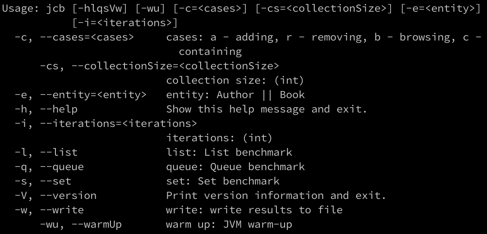

# collections-benchmarkController

## Usage

- ./gradlew run --args="--help"

## Example

- ./gradlew run --args="-l -c ar -e Book -cs 1000 -i 1000 -w"

| Model | Case             | Collection | Size | Current Size | Iterations | Operation (avg) time (ns) |
|-------|------------------|------------|------|--------------|------------|---------------------------|
| Book  | Adding(begin)    | ArrayList  | 1000 | 2000         | 1000       | 1348                      |
| Book  | Adding(begin)    | LinkedList | 1000 | 2000         | 1000       | 1118                      |
| Book  | Adding(middle)   | ArrayList  | 1000 | 2000         | 1000       | 619                       |
| Book  | Adding(middle)   | LinkedList | 1000 | 2000         | 1000       | 4261                      |
| Book  | Adding(end)      | ArrayList  | 1000 | 2000         | 1000       | 743                       |
| Book  | Adding(end)      | LinkedList | 1000 | 2000         | 1000       | 343                       |
| Book  | Removing(begin)  | ArrayList  | 1000 | 0            | 1000       | 1317                      |
| Book  | Removing(begin)  | LinkedList | 1000 | 0            | 1000       | 1045                      |
| Book  | Removing(middle) | ArrayList  | 1000 | 0            | 1000       | 2518                      |
| Book  | Removing(middle) | LinkedList | 1000 | 0            | 1000       | 1454                      |
| Book  | Removing(end)    | ArrayList  | 1000 | 0            | 1000       | 338                       |
| Book  | Removing(end)    | LinkedList | 1000 | 0            | 1000       | 538                       |

with `-w` option results are saved to file in `project_root/output` directory